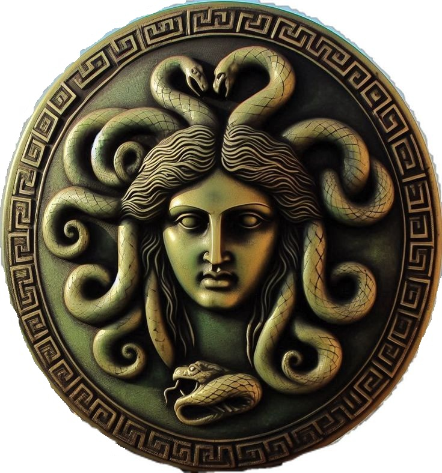

<p align="center">
  
</p>

<h1 align="center">Gorgon System</h1>

<p align="center">
  <em>Biology-inspired modular monitoring framework for ML, Data and DevOps workloads.</em>
</p>


<p align="center">
  <a href="https://www.python.org/">
    
  </a>
  <a href="#">
    
  </a>
  <a href="LICENSE">
    
  </a>
</p>

---

## 💡 What is Gorgon System?

**Gorgon System** is an experimental Python library for **modular monitoring and observability**,  
inspired by **jellyfish rhopalia** (sensors) and **octopus** coordination.

It aims to be:

- 🪶 **Lightweight** — simple to embed into scripts, notebooks and pipelines  
- 🧩 **Modular** — sensors, crabs, hub and “bell” are all pluggable  
- 🧠 **Future-proof** — a foundation for more advanced MAI (Memory–Attention–Inference) ideas  

Right now the project is in an early MVP stage, but already has a **full working vertical slice**:

> **Rhopalia → Crabs → Octopus → Gorgon Bell (CLI)**

---

## 🧬 Core Architecture

Gorgon System is built around four conceptual layers:

```text
+---------------------+        +-----------------+        +------------------+        +------------------+
|      Rhopalia       |  --->  |      Crabs      |  --->  |     Octopus      |  --->  |   Gorgon Bell    |
|  (atomic sensors)   |        | (monitor units) |        |  (central hub)   |        | (analysis / UI)  |
+---------------------+        +-----------------+        +------------------+        +------------------+
      CPU / RAM           CrabGuardian(local)              hub + buffer          CLI status (OK/WARN/CRIT)
1. Rhopalia — Sensors
Small, atomic units that collect raw metrics.

Current implementations:

RhopaliumCPU — system-wide CPU usage (%)

RhopaliumMemory — system-wide RAM usage (%)

They are intentionally tiny:

no global state,

single read() method,

no dependencies on higher layers.

2. Crabs — Monitoring Units
A Crab owns one or more Rhopalia and knows how and how often to poll them.

Current crab:

CrabGuardian

collect_once() → polls all attached sensors and returns a snapshot

keeps a lightweight in-memory buffer

simple blocking loop: run_forever()

3. Octopus — Central Hub
The Octopus is the central coordinator and message bus.

Responsibilities:

register crabs (register_crab(crab))

poll all registered crabs (collect_once())

keep a unified in-memory buffer (get_buffer())

MVP design goals:

No external DB required

Easy to swap storage layer later

Single “hub” object to integrate with higher-level tools (CLI, web UI, MAI, etc.)

4. Gorgon Bell — Analysis & Presentation
The “bell” that rings when something goes wrong.

Current implementation:

GorgonBellCLI

pulls data from Octopus for a given crab

computes simple status levels for CPU/RAM:

OK, WARN, CRIT

prints clean, human-readable lines to the console

This is the first UI layer; in the future it can be extended to:

rich colored CLI (with rich)

notebook widgets

web dashboards (Streamlit / Dash / FastAPI UI)

🚀 MVP Vertical Slice (implemented)
The current MVP is a full vertical path from raw metrics to human-readable status:

text
Copy code
Rhopalia (CPU, Memory)
        ↓
CrabGuardian (polls sensors, stores buffer)
        ↓
Octopus (hub, global buffer)
        ↓
GorgonBellCLI (OK / WARN / CRIT status lines)
All of this is already implemented and covered by working demos.

📦 Installation
1. Create and activate a virtual environment (recommended)
bash
Copy code
python -m venv .venv
.venv\Scripts\activate   # on Windows
# source .venv/bin/activate   # on Linux/macOS
2. Install in editable mode
From the project root:

bash
Copy code
pip install -e .
Requirements:

Python 3.10+

psutil

🧪 Examples
Three minimal demos are included in gorgon/examples/:

1. Direct CrabGuardian demo
Poll CPU & Memory directly via CrabGuardian:

bash
Copy code
python -m gorgon.examples.demo_cpu_mem
2. Octopus hub demo
Register a CrabGuardian inside Octopus and poll via the hub:

bash
Copy code
python -m gorgon.examples.demo_octopus_cpu_mem
3. GorgonBellCLI demo (full vertical)
Use GorgonBellCLI on top of Octopus:

bash
Copy code
python -m gorgon.examples.demo_bell_cli
🧱 Code Example
A minimal vertical integration in plain Python:

python
Copy code
from gorgon.rhopalia.cpu import RhopaliumCPU
from gorgon.rhopalia.memory import RhopaliumMemory
from gorgon.crabs.guardian import CrabGuardian
from gorgon.core.octopus import Octopus
from gorgon.bell.cli import GorgonBellCLI

# 1) Build sensors
sensors = [RhopaliumCPU(), RhopaliumMemory()]

# 2) Create a crab with these sensors
crab = CrabGuardian(
    name="local_system",
    sensors=sensors,
    interval=2.0,
    buffer_size=10,
)

# 3) Create an Octopus hub and register the crab
octo = Octopus(buffer_size=100)
octo.register_crab(crab)

# 4) Attach a CLI bell to this crab
bell = GorgonBellCLI(
    octopus=octo,
    crab_name="local_system",
    cpu_warn=70.0,
    cpu_crit=90.0,
    mem_warn=80.0,
    mem_crit=95.0,
)

# 5) Run a short monitoring session
bell.run(iterations=5)
🗂 Project Structure (MVP snapshot)
text
Copy code
gorgon-system/
├── gorgon/
│   ├── core/
│   │   ├── __init__.py
│   │   └── octopus.py          # Octopus hub
│   ├── crabs/
│   │   ├── __init__.py
│   │   └── guardian.py         # CrabGuardian
│   ├── rhopalia/
│   │   ├── __init__.py
│   │   ├── cpu.py              # RhopaliumCPU
│   │   └── memory.py           # RhopaliumMemory
│   ├── bell/
│   │   ├── __init__.py
│   │   └── cli.py              # GorgonBellCLI
│   └── examples/
│       ├── __init__.py
│       ├── demo_cpu_mem.py
│       ├── demo_octopus_cpu_mem.py
│       └── demo_bell_cli.py
├── tests/
├── docs/
│   └── gorgon-banner.png       # (to be added)
├── pyproject.toml
├── LICENSE
└── README.md
📍 Roadmap
✅ Already implemented
CPU sensor (RhopaliumCPU)

Memory sensor (RhopaliumMemory)

CrabGuardian (sync MVP)

Octopus core hub

GorgonBellCLI with simple status levels

Editable installation and demos

🧭 Planned
Async version of CrabGuardian

Additional rhopalia:

disk usage

network IO

GPU metrics

MAI (Memory–Attention–Inference) module (initial interface)

Web-based Bell (Streamlit / Dash)

Notebook-integrated Bell (Jupyter)

Storage backends (SQLite, DuckDB, Redis)

Packaging for PyPI

📄 License
Gorgon System is licensed under the Apache License 2.0.
See the LICENSE file for details.

🙌 About
This repository is both:

a personal research playground for monitoring, MLOps and AI-assisted self-monitoring, and

a real-world style project suitable for portfolios, interviews and apprenticeship applications.

Contributions, ideas and experiments are welcome.
