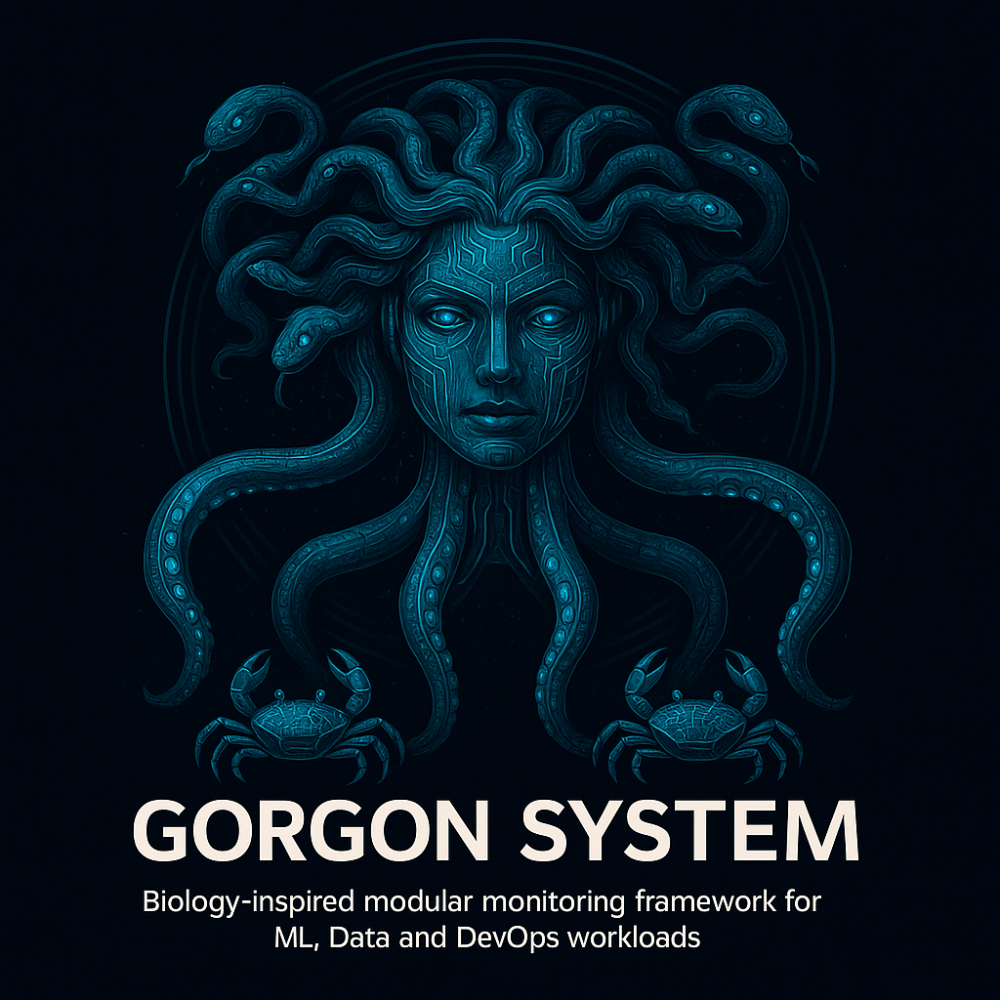

<p align="center">
  
</p>

<h1 align="center">Gorgon System</h1>

<p align="center">
  <em>Bio-inspired modular monitoring framework for ML, Data and DevOps workloads.</em>
</p>

<p align="center">
  <a href="https://www.python.org/"></a>
  <a></a>
  <a href="LICENSE"></a>
</p>

---

## 💡 What is Gorgon System?

**Gorgon System** is an experimental Python library for **modular monitoring and observability**,  
inspired by jellyfish sensory organs (*rhopalia*) and octopus neural coordination.

It is designed to be:

- 🪶 **Lightweight** — easy to embed into scripts, notebooks and pipelines  
- 🧩 **Modular** — sensors, crabs, hub and bell are all pluggable  
- 🧠 **Future-proof** — foundation for MAI (Memory–Attention–Inference)

The project already implements a **full working vertical slice**:

> **Rhopalia → Crabs → Octopus → Gorgon Bell (CLI)**

---

## 🧬 Core Architecture

### Gorgon System layers

```
+---------------------+        +-----------------+        +------------------+        +------------------+
|      Rhopalia       |  --->  |      Crabs      |  --->  |     Octopus      |  --->  |   Gorgon Bell    |
|  (atomic sensors)   |        | (monitor units) |        |  (central hub)   |        | (analysis / UI)  |
+---------------------+        +-----------------+        +------------------+        +------------------+
      CPU / RAM           CrabGuardian(local)              hub + buffer          CLI status (OK/WARN/CRIT)
```

---

### 1. Rhopalia — Sensors

Small, atomic metric collectors.

Current sensors:

- `RhopaliumCPU` — system CPU load (%)
- `RhopaliumMemory` — RAM usage (%)

Characteristics:

- no global state  
- single `read()` method  
- intentionally tiny  

---

### 2. Crabs — Monitoring Units

A Crab owns multiple rhopalia and controls how they are polled.

MVP Crab: **CrabGuardian**

- `collect_once()`  
- lightweight ring buffer  
- simple blocking loop  

---

### 3. Octopus — Central Hub

The Octopus is the coordination core:

- registers crabs (`register_crab`)  
- polls crabs  
- stores unified buffer (`get_buffer`)  

Design goals:

- no external database  
- easy to extend (SQLite, DuckDB)  
- single integration point for UI and MAI  

---

### 4. Gorgon Bell — Analysis & Presentation

Current implementation: **GorgonBellCLI**

- pulls metrics from the Octopus  
- evaluates CPU/RAM  
- prints human-readable status:
  - OK  
  - WARN  
  - CRIT  

Future versions:

- “rich” colored terminal mode  
- Jupyter notebook widgets  
- web dashboards (Streamlit / FastAPI UI)  

---

## 🚀 MVP Vertical Slice (Fully Implemented)

```
Rhopalia (CPU, Memory)
        ↓
CrabGuardian (polls sensors)
        ↓
Octopus Hub (global buffer)
        ↓
GorgonBellCLI (status output)
```

---

## 📦 Installation

### 1. Create a virtual environment

```bash
python -m venv .venv
.venv\Scripts\activate       # Windows
# source .venv/bin/activate  # Linux/macOS
```

### 2. Install in editable mode

```bash
pip install -e .
```

Requirements:

- Python 3.10+
- psutil

---

## 🧪 Examples

Located under `gorgon/examples/`.

### Direct CrabGuardian

```bash
python -m gorgon.examples.demo_cpu_mem
```

### Octopus Hub

```bash
python -m gorgon.examples.demo_octopus_cpu_mem
```

### Full vertical demo (CLI)

```bash
python -m gorgon.examples.demo_bell_cli
```

---

## 🧱 Minimal Code Example

```python
from gorgon.rhopalia.cpu import RhopaliumCPU
from gorgon.rhopalia.memory import RhopaliumMemory
from gorgon.crabs.guardian import CrabGuardian
from gorgon.core.octopus import Octopus
from gorgon.bell.cli import GorgonBellCLI

sensors = [RhopaliumCPU(), RhopaliumMemory()]
crab = CrabGuardian("local_system", sensors, interval=2.0, buffer_size=10)

octo = Octopus(buffer_size=100)
octo.register_crab(crab)

bell = GorgonBellCLI(octopus=octo, crab_name="local_system")
bell.run(iterations=5)
```

---

## 🗂 Project Structure

```
gorgon-system/
├── gorgon/
│   ├── core/
│   ├── crabs/
│   ├── rhopalia/
│   ├── bell/
│   └── examples/
├── tests/
├── docs/
├── LICENSE
├── pyproject.toml
└── README.md
```

---

## 🧭 Roadmap

### ✔ Implemented
- CPU / RAM rhopalia  
- CrabGuardian (sync MVP)  
- Octopus Hub  
- GorgonBellCLI  
- Working demos  
- Editable installation  

### 🧩 Planned
- AsyncCrabGuardian  
- Disk / Network / GPU rhopalia  
- Stethoscope mode (short-buffer instant graph)  
- Jupyter notebook bell  
- MAI Engine 0.1  
- Storage backends (SQLite / DuckDB / Redis)  
- Web UI  
- PyPI packaging  

---

## 📄 License

Apache License 2.0 — see `LICENSE`.

---

## ⚖️ Legal Notice

Gorgon System is released under the **Apache License 2.0**.  
All original architectural concepts, names, and terminology:

- Rhopalia Sensors  
- Crabs Monitoring Agents  
- Octopus Hub  
- Gorgon Bell  
- Subumbrella / Exumbrella  
- MAI Engine (Memory–Attention–Inference)

were created by **Vladimir Brilliantov** (2025) and remain part of his
intellectual authorship.

This project is intended as an experimental developer-first framework and  
**does not compete** with Prometheus, OpenTelemetry, Datadog, New Relic,
or any enterprise-grade observability platform.

Instead, it acts as an **integration-oriented sensory and analytical layer**,  
compatible with industry standards and external monitoring systems.

For full legal explanation, see `LICENSE.md` and `NOTICE.md`.


## 👤 Author

© **2025 Vladimir Brilliantov**  
Creator of the GORGON System architecture  
(Rhopalia Sensors, Crabs Monitoring Agents, Octopus Hub, Gorgon Bell, MAI Engine).
